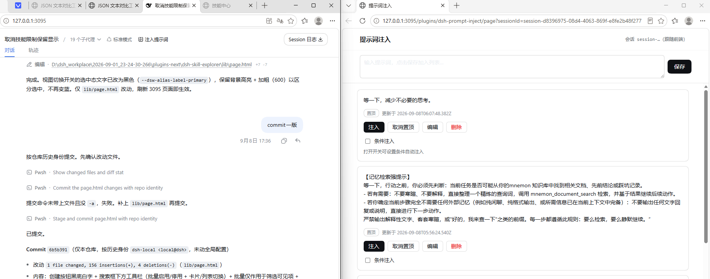
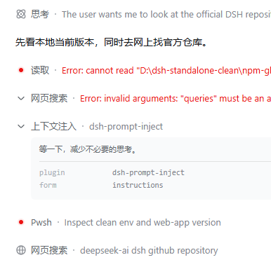
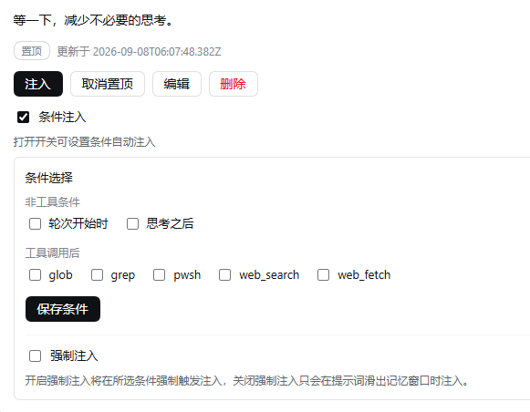

# dsh-prompt-inject

[](https://www.npmjs.com/package/@jojoman2024/dsh-prompt-inject)
[](./LICENSE)
[](./package.json)
[](./package.json)

**DSH（DeepSeek Harness）提示词注入插件** —— 在轮次中间，per-step注入用户设定的提示词。独立标签页集中管理，提示词落盘，方便复用；可手动一次性注入，也可按条件（轮次开始 / 思考之后 / 指定工具调用后）在轮次会话中自动注入，避免打断输出重新调用模型。

## 截图

**会话头部入口 + 独立标签页管理页**

给dsh插件开发者一个建议，有很多插件没必要非得挤在dsh的官方UI里，大多不方便，而且丑。模块化嘛。你桌面那么大，何必呐。





**条件注入面板**

每条提示词可开启「条件注入」：非工具条件（轮次开始时 / 思考之后）+ 工具调用后（glob / grep / pwsh / web_search / web_fetch），以及「强制注入」开关。
配置按会话隔离，互不干扰。切换会话时，自动识别会话，避免提示词串入。



## ✨ 核心点

- **绝不改 system prompt**：不会破坏缓存。注入走 `agent/pre-step` 的插件 user 消息，对会话日志零侵入、可审计，不会触发会话格式兼容问题。
- **窗口判据，不浪费 token**：条件注入模式，关闭强制注入时，唯一注入判据是「这条提示词是否还在模型当前窗口里」——已滑出窗口才补注一次，不做任何旁路 LLM 调用、不跑合规判断。开启「强制注入」则条件命中即注入。
- **手动一次性注入**：点【注入】即排队，该会话下一次模型 step 前生效（仅注入一次，10 分钟 TTL 自动失效，重复点击覆盖式排队）。
- **条件注入（逐步注入）**：轮次开始时 / 思考之后 / 工具调用后命中 → 入队 → 本轮内消费、轮末自动丢弃。语义是「在这一步提醒模型」，而不是永久改写行为。
- **会话作用域，重启全关**：逐步/强制注入配置是纯内存态、按会话隔离 —— 重启后全部默认关闭，绝无「忘了关导致后台一直注入」的隐患。正文与置顶则持久化到 `$DSH_HOME/dsh-prompt-inject/prompts.json`，插件自有落盘，不污染会话日志。
- **多开标签页实时跟随**：会话头部入口 `window.open` 打开独立管理页；前端切换会话时通过 `BroadcastChannel` 广播，所有已打开的管理页实时跟随当前会话。
- **官方观感**：入口按钮逐字节复刻官方 `IconContextInjectionOutline16` 图标、对齐官方 chip 样式；管理页使用 `--dsw-alias-*` 主题 token，明暗主题跟随 DSH 外观设置（light / dark / system）。
- **零框架管理页**：管理页是自包含原生 JS 单文件（host 实时返回），不拖任何前端运行时；host + client 双端预构建产物，`dsh plugin add` 一条命令即装。避免官方升级连ui也要改（捂脸.jpg）

## 📦 安装

### 方式一：一条命令安装（推荐）

> npm 包地址：<https://www.npmjs.com/package/@jojoman2024/dsh-prompt-inject>

```bash
dsh plugin add --profile web @jojoman2024/dsh-prompt-inject
```

官方 CLI 会把包装进 web profile，并**自动把插件注册进 `dsh.profile.bundles`**（依据包内 `cordis.patch.yml` 声明）。完成后重启 DSH web 即生效。

### 方式二：手动安装（CLI 与运行时版本不匹配时的兜底）

```bash
cd <你的DSH home>/profiles/web
pnpm add @jojoman2024/dsh-prompt-inject
```

然后在 profile 的 `package.json` 中把插件加入 bundle 列表：

```jsonc
{
  "dsh": {
    "profile": {
      "bundles": [
        // ... 已有插件
        "@jojoman2024/dsh-prompt-inject"
      ]
    }
  }
}
```

重启 DSH web 后生效（bundle 行新增需要 loader 重组合）。

### 方式三：本地 link 开发安装

```bash
git clone <repo-url>
cd dsh-prompt-inject
pnpm install
pnpm build        # tsdown 产出 lib/
```

一条命令把本地副本挂进 profile（也走 bundle 自动注册）：

```bash
dsh plugin add --profile web link:X:/path/to/dsh-prompt-inject
```

或手动在 web profile 的 `package.json` 里用 `link:` 声明本地副本：

```jsonc
{
  "dependencies": {
    "@jojoman2024/dsh-prompt-inject": "link:X:/path/to/dsh-prompt-inject"
  }
}
```

同样把 `"@jojoman2024/dsh-prompt-inject"` 加入 `dsh.profile.bundles` 后重启 DSH web。

本地方式声明，如果改动 `src/` 需重新 `pnpm build`，重启即生效。

## 🚀 使用

1. 打开任意会话，点击会话头部工具条的 **「注入提示词」**，进入独立管理页（自动绑定当前会话）。
2. 输入提示词 → **保存**。条目卡片支持：**置顶 / 注入 / 编辑 / 删除**。
3. **注入**：手动一次性注入，该会话下一次模型 step 前生效（仅当提示词不在窗口中才补注；10 分钟内未消费自动失效）。
4. **条件注入**：勾选后展开条件面板 ——
   | 条件 | 触发时机 |
   | --- | --- |
   | 轮次开始时 | 用户消息后的第一个模型 step |
   | 思考之后 | 模型推理结束（reasoning block 结束或首个文本输出） |
   | 工具调用后 | 勾选的指定工具（glob / grep / pwsh / web_search / web_fetch）执行完成之后 |
5. **强制注入**：开启 = 条件命中即注入；关闭 = 仅当该提示词已滑出模型记忆窗口时才注入（推荐日常关闭，遵循度提醒按需补注）。

> ⚠️ 条件注入与强制注入配置均为**会话作用域内存态**：重启 DSH 或新开会话后默认全部关闭，需要重新勾选。
> ⚠️ 条件注入模式，可能会发生注入延迟。需要准确 per-step 注入请手动点击注入按钮。

## 🔧 注入机制

```
条件命中 / 手动注入
      │  入队（10min TTL，覆盖式）
      ▼
agent/pre-step（下一次模型 step 前）
      │  合并 手动队列 + 逐步队列
      │  窗口判断：提示词原文是否已在本次请求 messages 中
      ▼
不在窗口（或强制注入）→ 追加一条插件 user 消息 → 注入一次
轮次结束 → 丢弃本轮未消费的逐步队列
```

关键设计约束（也是本插件的稳定性来源）：

- `llm/stream` 监听器只读取 chunk 元数据、**永远原样透传**，绝不 yield 新建/改写对象（避免 agent-loop 落盘序列化失败）；
- 注入消息带 `source: { kind: 'plugin', plugin: 'dsh-prompt-inject', form: 'instructions' }`，来源可审计；
- 提示词正文全局共享，逐步注入配置按会话隔离；删除提示词时同步清理所有会话的逐步配置。

## 🗂 数据位置

| 数据 | 位置 | 持久性 |
| --- | --- | --- |
| 提示词正文 / 置顶 | `$DSH_HOME/dsh-prompt-inject/prompts.json` | 落盘持久化 |
| 逐步/强制注入配置 | 运行期内存（按会话隔离） | 重启即清空 |
| 注入队列 | 运行期内存 | 10 分钟 TTL / 消费即清 |

`DSH_HOME` 缺省为 `~/.dsh`。

## 🧩 兼容性

- DSH web profile 插件（host + client 双端），peer 依赖 `@deepseek-ai/*` `^0.1.0-rc.6 || ^0.1.1-rc.2 || ^0.1.2-alpha.x`，React 18（客户端槽组件）。
- Node `^22.19.0 || >=24.0.0`。

## 🛠 开发

```bash
pnpm install
pnpm typecheck   # host + client 双 tsconfig
pnpm build       # tsdown → lib/
```

源码结构：

```
src/
├── client/index.tsx   # 会话头部「注入提示词」按钮（slots 注入 + BroadcastChannel 会话跟随）
└── host/
    ├── index.ts       # HTTP API + llm/stream、tools/post-execute、agent/pre-step 注入管线
    ├── store.ts       # prompts.json 落盘 + 会话作用域逐步配置
    └── page.ts        # 自包含管理页（原生 JS 单文件）
```

## License

[MIT](./LICENSE)
